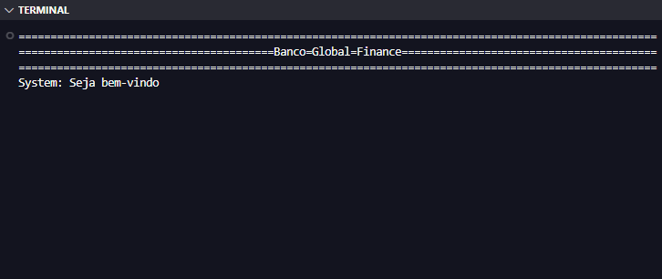
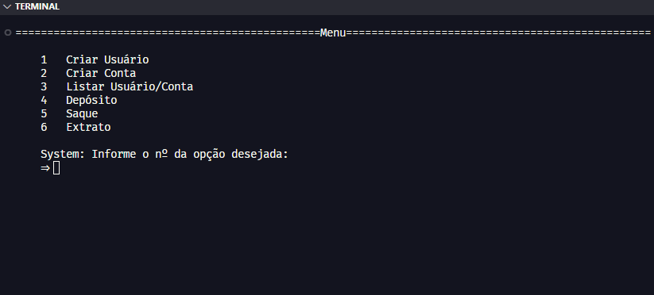
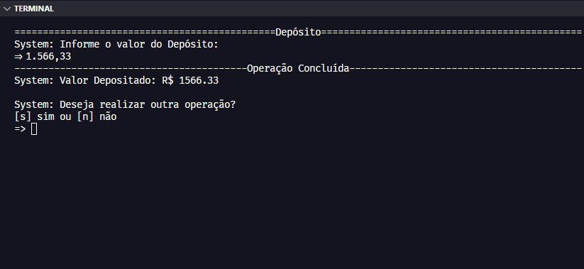
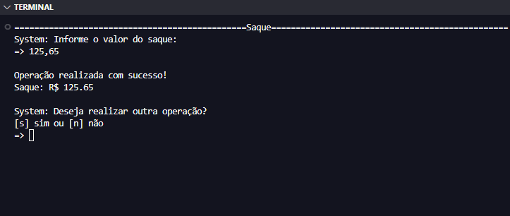
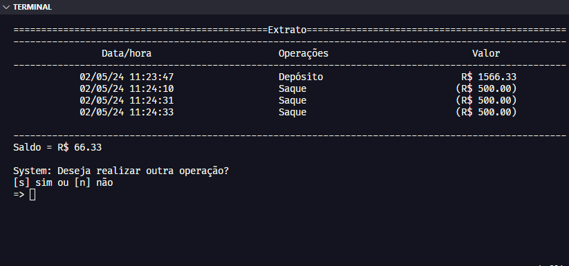
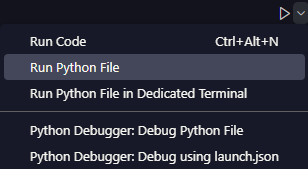

# Ferramenta: Sistema Bancário

## 👨🏻‍💻 Abrir Projeto:

🖥️Acesso 
Para ter acesso ao código, você irá precisar:

Python: Ter o Python instalado. Você pode baixar a versão mais recente do Python no site oficial [python.org](https://www.python.org/downloads/). 
Editor de Código: Ter um ambiente de desenvolvimento integrado (IDE). Recomendo o [VsCode](https://code.visualstudio.com/download). 

Abra o arquivo: "main.py" no seu editor de Código (VsCode) e terá acesso completo ao código. 
Para executá-lo clique na opção: `Run Python File` na parte superior direita do VsCode. 
Ele irá abrir o terminal no qual poderá interagir com o sistema.

## 📝 Introdução

Sistema Bancário criado para a empresa Global Finance, realizar suas operações financeiras.

## 💡 Sobre

Fui contratado pelo Banco Global Finance para desenvolvimento de seu novo sistema. Esse banco deseja modernizar suas operações e para isso escolheu a linguagem Python.  
Para a primeira versão do sistema iremos implementar 3 operações: Saque, Depósito e Visualizar Extrato.

📩 Depósito: 
O sistema deve permitir realizar 3 saques diários com limite máximo de R$ 500,00 por saque. 
Caso o usuário não tenha saldo em conta, o sistema deve exibir uma mensagem informando que não será possível sacar o dinheiro por falta de saldo.  
Todos os saques devem ser armazenados em uma variável e exibidos na operação de Extrato.

💸 Saque: 
Deve ser possível depositar valores positivos para a conta bancária.  
A v1 do projeto trabalha apenas com 1 usuário, dessa forma não precisamos nos preocupar em identificar qual é o número da agência e conta bancária.  
Todos os depósitos devem ser armazenados em uma variável e exibidos na operação de extrato.

📜Extrato: 
Essa operação deve listar todos os depósitos e saques realizados na conta. No fim da listagem deve ser exibido o saldo atual da conta.  
Se o extrato estiver em branco, exibir a mensagem: Não foram realizadas movimentações.  
Os valores devem ser exibidos utilizando o formato R$ xxx.xx, exemplo: 1500.45 = R$ 1500.45

## 📚 Conhecimentos

Para estudo e aplicação do projeto, foi utilizado os conteúdos:

- [Python AI Backend Developer](https://web.dio.me/track/coding-future-vivo-python-ai-backend-developer)

## 🤖 Tecnologias

  

---

- `Python`: O Python é a linguagem de programação utilizada para tornar real nosso Sistema Bancário, definindo as regras, cálculos e funções necessárias para automatizar e executar o projeto, respeitando as regras do negócio.

---

**Desenvolvido por [Rodrigo Moraes](https://github.com/rodrigomoraesdev)**
