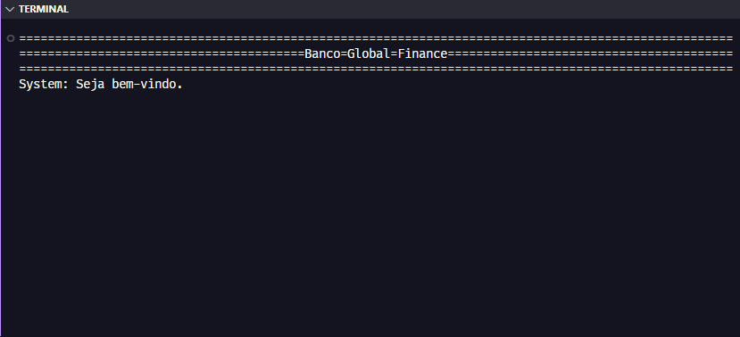
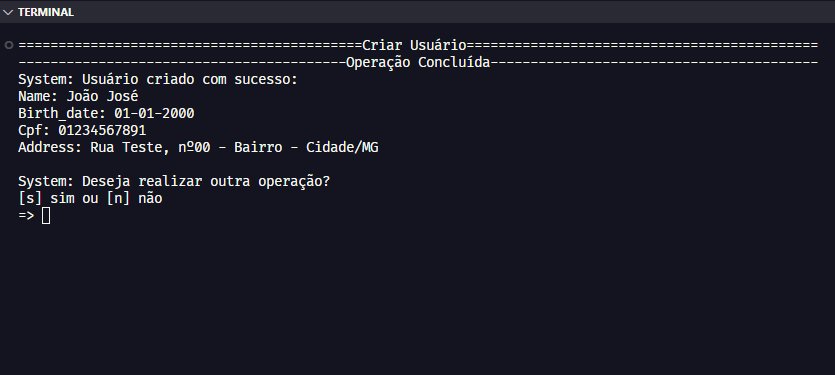
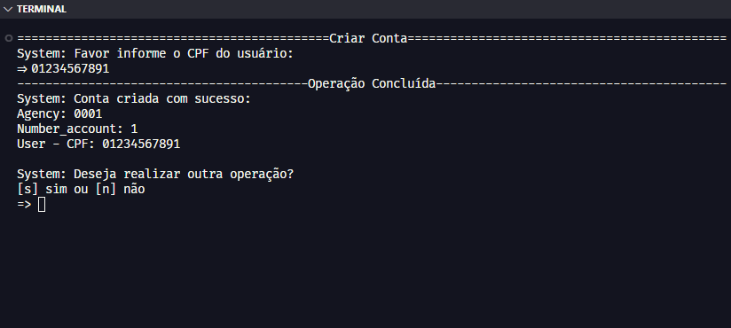
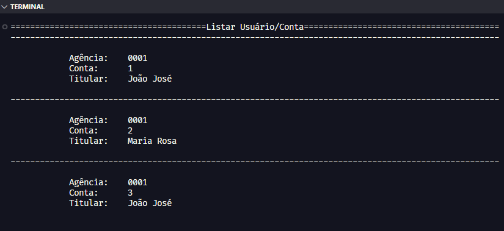
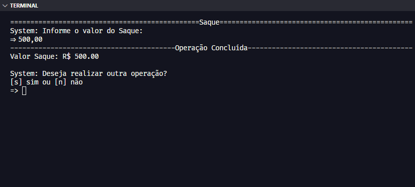

# Sistema: Banking Global Finance

## 👨🏻‍💻 Abrir Projeto:

🖥️Acesso 
Para ter acesso ao código, você irá precisar:

Python: Ter o Python instalado. Você pode baixar a versão mais recente do Python no site oficial [python.org](https://www.python.org/downloads/). 
Editor de Código: Ter um ambiente de desenvolvimento integrado (IDE). Recomendo o [VsCode](https://code.visualstudio.com/download). 

Abra o arquivo: "main.py" no seu editor de Código (VsCode) e terá acesso completo ao código. 
Para executá-lo clique na opção: `Run Python File` na parte superior direita do VsCode. 
Ele irá abrir o terminal no qual poderá interagir com o sistema.

## 📝 Introdução

Essa é a versão 2.0 que criei do Sistema Bancário criado para a empresa Global Finance, realizar suas operações financeiras.

## 💡 Sobre

Fui contratado pelo Banco Global Finance para desenvolvimento de seu novo sistema. Esse banco deseja modernizar suas operações e para isso escolheu a linguagem Python.  
Para essa segunda versão, além de otimizar as 3 operações iniciais: Saque, Depósito e Visualizar Extrato, através de funções, também desenvolvi novas funcionalidades, como: Criar Usuário, Criar Conta e Listar Usuário/Conta. 
Isso tudo, respeitando todas as regras do negócio:

📇 Criar Usuário: 
Essa nova funcionalidade permite criar usuários em uma lista, com os seguintes dados: "Nome, Data de Nascimento, CPF (apenas números) e Endereço". 
O endereço segue o formato: "Logradouro, nr - Bairro - Cidade/Sigla Estado". 
Uma validação impede o cadastro de dois ou mais usuários com o mesmo CPF. 

💳 Criar Conta: 
Essa nova funcionalidade permite criar contas, cada uma composta por: "Agência, Número da Conta e Usuário". 
A Agência é fixa: "0001", e o Número da Conta é sequencial, começando em 1. Isso permite que um usuário tenha mais de uma conta. 
Se não houver contas cadastradas, uma mensagem informa ao usuário o motivo. 

🗒️ Listar Usuário/Conta: 
Desenvolvi essa função para facilitar a consulta das contas criadas, exibindo detalhes como Agência, Conta e Titular. 

📨 Depósito: 
Apenas valores positivos são aceitos para depósito. Se o valor for diferente, o sistema informa que a operação é inválida. 
Todos os depósitos são registrados e exibidos no Extrato. 

💸 Saque: 
O sistema permite até 3 saques diários, com um limite máximo total de R$ 500,00 por saque. Se esse limite for ultrapassado, o sistema informa o motivo. 
Se o usuário não tiver saldo suficiente, uma mensagem avisa sobre a impossibilidade de realizar o saque. 

📜Extrato: 
Essa operação lista todos os depósitos e saques, mostrando também o saldo atual da conta. 
Se não houver movimentações, é exibida a mensagem padrão: "Não foram realizadas movimentações". 
Os valores são exibidos no formato R$ xxx.xx, por exemplo: R$ 1500.45. 

## 📚 Conhecimentos

Para estudo e aplicação do projeto, foi utilizado os conteúdos:

- [Python AI Backend Developer](https://web.dio.me/track/coding-future-vivo-python-ai-backend-developer)

## 🤖 Tecnologias

  

---

- `Python`: O Python é a linguagem de programação utilizada para tornar real nosso Sistema Bancário, definindo as regras, cálculos e funções necessárias para automatizar e executar o projeto, respeitando as regras do negócio.

---

**Desenvolvido por [Rodrigo Moraes](https://github.com/rodrigomoraesdev)**
